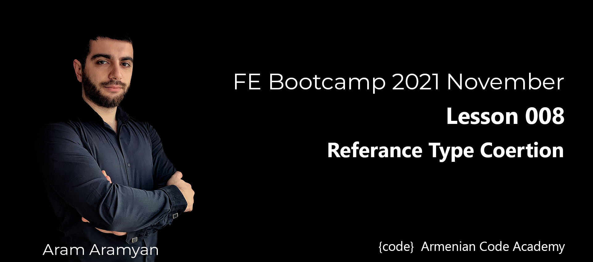

---

***Please try to guess, test, and then understand following examples: wit binary operators***\
[binaryOperator.js](binaryOperator.js)
___

***lease try to guess, test, and then understand following examples: wit unary operator***\
[unaryOperator.js](unaryOperator.js)
___